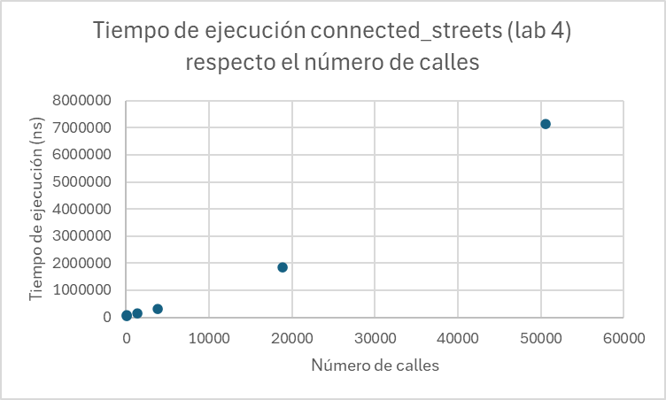

## Report

**1. Runtime complexity analysis of initializing the intersections map in Big-O. Include the average, best and worst cases if they are different.**

The build intersection map function

**2. Runtime complexity analysis of finding the coordinates of a street or place given the name in Big-O. Include the average, best and worst cases if they are different.**

**3. Runtime complexity analysis of your path-finding algorithm in Big-O. Include the average, best and worst cases if they are different.**

**4. A plot comparing the latency to find connected streets by sequentially looking through the list (lab 4) compared to using the intersections map (lab 5), depending on the map size.**

    **- Experimentally determine the results by measuring multiple times your program's behaviour with different relevant scenarios in the same machine. Include your raw data in the report, besides the plot.**

    **- Explain the results.**
We have selected 5 random streets for each map:
    xs_1:
    C. del Baixant 1
    Av. Vertical ,1
    C. Pompeu Fabra ,2
    Av. Horitzontal ,1
    C. Pompeu Fabra ,10
    xs_2:
    Avinguda Diagonal ,197
    Rambla del poblenou ,130
    Carrer de la Llacuna ,118
    Carrer de Pere IV ,151
    Carrer dels Solsticis ,3
    md_1:
    Carrer de Pujades ,309
    Carrer de Pamplona ,106
    Carrer del Clot ,38
    Passatge de Caminal ,24
    Carrer d'Àlaba ,146
    lg_1:
    Carrer de Pujades ,309
    Carrer de Sicília ,166
    Carrer de Flandes ,9
    Carrer de Pere IV ,47
    Carrer del Consell de Cent ,426
    xl_1:
    Carrer de Ramón y Cajal ,24
    Passeig dels Til·lers ,19
    Carrer de Còrsega ,701
    Carrer de Blasco de Garay ,10
    Carrer del Marroc ,105
    2xl_1:
    Passeig de la Vall d'Hebron ,159
    Avinguda de Catalunya ,72
    Carrer de Palaudàries ,12
    Carrer del Torrent de la Guineu ,116
    Carrer de Pallars ,445
To compare the latency, we have applied the time function to connected_streets and connected_streets_fast. Asking for the same street, we compared the time...  

**5. A plot comparing the latency to find a path between two points finding connected streets sequentially looking through the list compared to using the intersections map, depending on the map size (but keeping the same origin and destination).**

    **- Experimentally determine the results by measuring multiple times your program's behaviour with different relevant scenarios in the same machine. Include your raw data in the report, besides the plot.**

    **- Explain the results.**

**6. A plot comparing the latency to find a path between two points finding connected streets sequentially looking through the list compared to using the intersections map, depending on the distance between the origin and destination (but using the same map).**

    **- Experimentally determine the results by measuring multiple times your program's behaviour with different relevant scenarios in the same machine. Include your raw data in the report, besides the plot.**

    **- Explain the results.**

    **- Fit a curve and justify it based on the runtime complexity from question 3.**

**7. Describe an improvement to the visited data structure in the BFS algorithm to improve latency.**

    **- Justify which data structure you would use / have used instead of a list to improve performance.**

    **- Describe its current runtime complexity and the improved runtime complexity.**

    **- Describe any trade-offs or downsides of your approach regarding latency or memory usage.**

**8. Describe an improvement to the algorithm to find the street segment given a latitude and longitude to improve its runtime complexity / latency.**

    **- Justify which data structure or algorithm you would use / have used to improve latency.**

    **- Describe its current runtime complexity and the improved runtime complexity.**

    **- Describe any trade-offs or downsides of your approach regarding latency or memory usage.**
