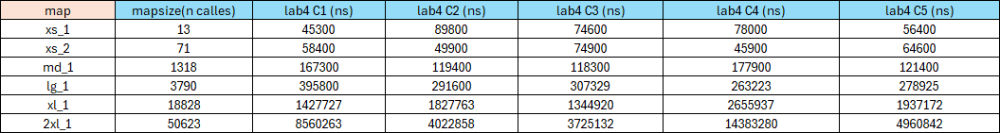
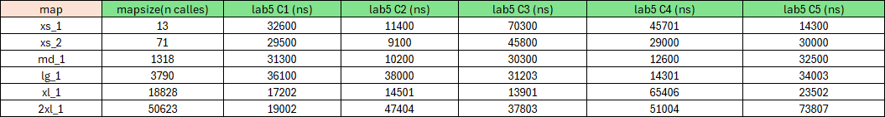
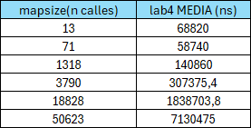
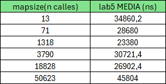
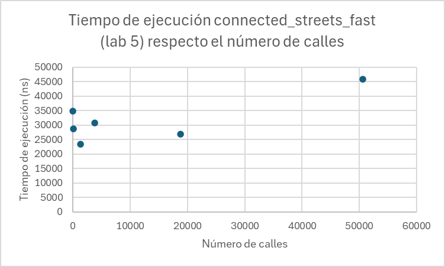
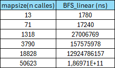
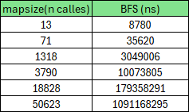
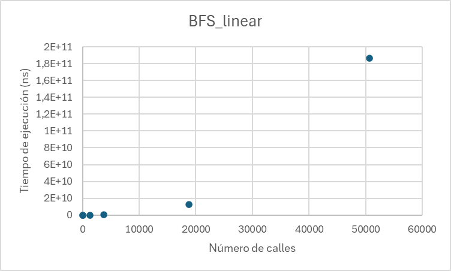
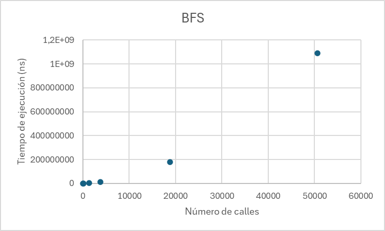

# Report

**1. Runtime complexity analysis of initializing the intersections map in Big-O. Include the average, best and worst cases if they are different.**

The build intersection map function iterates over the linked list of street segments calling the function hashmap insert twice, for node1_id and for node2_id.
The runtime complexity of the hashmap insert function is related to the hash function choosen. If it is well-distributed, the load factor will be low so the the average case would be O(1), the best case would be when the bucket is empty beeing also O(1) complexity. The worst scenario would be when lot of keys collide into the same bucket, forcing to go over all the list on every insert, the complexity would become O(n), n beeing the number of streets in the linked list.

Because of build intersection map calls hashmap insert 2n, the best and average case would be O(n): each insert is O(1), so n inserts is O(n). The worst case would be O(n²).

**2. Runtime complexity analysis of finding the coordinates of a street or place given the name in Big-O. Include the average, best and worst cases if they are different.**

The find place function calls normalize, get type and strips prefix and levenshtein, going over the linked list of places and comparing names.
Normalize, get type and strips prefix and levenshtein functions are all string related. The cost by node are O(k), O(k) and O(K^2) respectively, beeing k the length of the string. However, as the size of the strings are limited by a constant (#define SIZE 256), the cost is now O(256^2) which is considered constant asympotically O(1).

As a result of that, the runtime complexity of finding the coordinates of a street or place given the name is O(n), beeing n the number of places in the linked list. The best case is considered when the fist element on the list is the place that we are looking for, so complexity is O(1), the average case would be when the place is in the middle of the list, it would be O(n). 
Finally, the worst case would be when the place is not found on the first iteration so the function called place is called recursively again so complexity is O(n) + O(n) = O(2n), which overall is O(n).

**3. Runtime complexity analysis of your path-finding algorithm in Big-O. Include the average, best and worst cases if they are different.**

The path-finding algorithm choosen is BFS which uses a queue in which in each element stores a linked list of the path found since that moment and a hashmap function to know if a street has already been visited.

The BFS function calls all queue function: enqueue and free queue which have the complexity of O(n), n beeing the size of the queue and dequeue which has O(1).
Also calls is visted hash and visted hash map insert which have O(1) complexity and add to path which has a O(k) complexity where k is the current path length.

Overall, the best case would be O(1), when the origin and the destination are adjacents, the average case would be O((v + e)·(n + k)), where v are the number of street segments (vertices) and e the number of connections between them. For each vertice v and each connection e, it executes add to path and enqueue so the complexity for each connection is O(k + n) as these is executed e and v times, it turns O((v + e)·(n + k)). The worst case would be when k + n approach to v so the complexity is O((v + e)· v).

**4. A plot comparing the latency to find connected streets by sequentially looking through the list (lab 4) compared to using the intersections map (lab 5), depending on the map size.**

**- Experimentally determine the results by measuring multiple times your program's behaviour with different relevant scenarios in the same machine. Include your raw data in the report, besides the plot.**

**- Explain the results.**

### Test cases:
We have selected 5 random streets for each map:

| Map | Street | Number |
|-----|--------|--------|
| **xs_1** | C. del Baixant | 1 |
| | Av. Vertical | 1 |
| | C. Pompeu Fabra | 2 |
| | Av. Horitzontal | 1 |
| | C. Pompeu Fabra | 10 |
| **xs_2** | Avinguda Diagonal | 197 |
| | Rambla del Poblenou | 130 |
| | Carrer de la Llacuna | 118 |
| | Carrer de Pere IV | 151 |
| | Carrer dels Solsticis | 3 |
| **md_1** | Carrer de Pujades | 309 |
| | Carrer de Pamplona | 106 |
| | Carrer del Clot | 38 |
| | Passatge de Caminal | 24 |
| | Carrer d'Àlaba | 146 |
| **lg_1** | Carrer de Pujades | 309 |
| | Carrer de Sicília | 166 |
| | Carrer de Flandes | 9 |
| | Carrer de Pere IV | 47 |
| | Carrer del Consell de Cent | 426 |
| **xl_1** | Carrer de Ramón y Cajal | 24 |
| | Passeig dels Til·lers | 19 |
| | Carrer de Còrsega | 701 |
| | Carrer de Blasco de Garay | 10 |
| | Carrer del Marroc | 105 |
| **2xl_1** | Passeig de la Vall d'Hebron | 159 |
| | Avinguda de Catalunya | 72 |
| | Carrer de Palaudàries | 12 |
| | Carrer del Torrent de la Guineu | 116 |
| | Carrer de Pallars | 445 |

To compare the latency, we have applied the time function to connected_streets and connected_streets_fast. Asking for the same street, we compared the time of execution of 5 different streets from each map and we wrote down the time results on two separated charts, one for lab 4 results and the other for lab 5, as it is shown in the following images:
 

When we had mesured all the times, we calculated the average time execution for each map. The same as before, we did a two separated charts with the results:

Finally we made two plots with the calculated results:

In these two plots we can see a clear difference between the two labs. 
The sequential approach find_connected_streets gets slower as the size of the map grows, because it has to search among all streets to find it. With the smaller map, it takes around 68820 ns and 7130475 ns for the longest, which is a difference of 7061655 ns.

The intersection map find_connected_streets_fast whereas the sequential approach grows, this approach takes almost the same amount of time in the smallest map than in the longest map. The first one with 34860.2 ns and the last one with 45804 ns which is a difference of 10943.8 ns. As we can see there is a huge difference between the sequential approach and the hashmap. 

**5. A plot comparing the latency to find a path between two points finding connected streets sequentially looking through the list compared to using the intersections map, depending on the map size (but keeping the same origin and destination).**

**- Experimentally determine the results by measuring multiple times your program's behaviour with different relevant scenarios in the same machine. Include your raw data in the report, besides the plot.**

**- Explain the results.**

### Test Cases:
We have selected a random path for each map:

| Map | | Street | Number |
|-----|-|--------|--------|
| **xs_1** | Origin | C. del Baixant | 1 |
| | Destination | Av. Horitzontal | 24 |
| **xs_2** | Origin | Avinguda Diagonal | 197 |
| | Destination | Rambla del Poblenou | 130 |
| **md_1** | Origin | Carrer de Pujades | 309 |
| | Destination | Carrer de Pamplona | 106 |
| **lg_1** | Origin | Carrer de Pujades | 309 |
| | Destination | Carrer de Sicília | 166 |
| **xl_1** | Origin | Carrer de Ramón y Cajal | 24 |
| | Destination | Passeig dels Til·lers | 19 |
| **2xl_1** | Origin | Passeig de la Vall d'Hebron | 159 |
| | Destination | Avinguda de Catalunya | 72 |

We followed the same procedure as the question 4, this time choosing a random path for each map, and writing the results on two separated charts, one for the linear search and the other for the hashmap as it is shown in the images below.

Then, we made two plots with the calculated results:

As we can see, with the 2 smallest maps (xs_1, xs_2), the linear search is slightly faster than the hashmap, but when the map gets bigger, the intersection map becomes much faster, there is a huge difference, even the largest map with hash search is around 10 times smaller than the fifth map of the linear search.

The linear map has to go through all the street linked list every time it has to look for a connected street while the intersection map has the connections already stored so it finds them faster.

**6. A plot comparing the latency to find a path between two points finding connected streets sequentially looking through the list compared to using the intersections map, depending on the distance between the origin and destination (but using the same map).**

**- Experimentally determine the results by measuring multiple times your program's behaviour with different relevant scenarios in the same machine. Include your raw data in the report, besides the plot.**

**- Explain the results.**

**- Fit a curve and justify it based on the runtime complexity from question 3.**

**7. Describe an improvement to the visited data structure in the BFS algorithm to improve latency.**

**- Justify which data structure you would use / have used instead of a list to improve performance.**

**- Describe its current runtime complexity and the improved runtime complexity.**

**- Describe any trade-offs or downsides of your approach regarding latency or memory usage.**

We used a hash table for the visited nodes because we already had a hashmap implementation available and only needed to adapt it to store visited streets.

With the original linked-list implementation, inserting a visited node takes O(1) time. However, checking whether a street has already been visited requires traversing the list, which takes O(n) time in the worst case, where n is the number of visited streets.

With a hash table, both insertion and lookup operations become O(1) on average. This is because a hash function is used to compute an index (key) that directly maps a street to a specific bucket in the table. Then it goes through all the nodes that are on that bucket to see if the node have been visited. In the worst case scenario that takes O(k) time, where k is the number of visited nodes in that bucket, but in average that should thake O(1) time if the implemented hash function is good.

In our code, the linked-list implementation takes O(V^2), where V are the visited streets, because the function is_visited() has to go through all the list in the worst case scenario and to implement this in the BFS function we call it V times. However, the improved code use is_visited_hash() instead of is_visited(), which has a big-O complexity of O(1) because of the hash. Then the function is called V times so the excecution time becomes O(V).

The trade-offs of doing this is that, even if the latency is better with the hash table it doesn't has a dynamic memory like the linked list so it may not be as memory efficient. For this reason, with maps like xs_1 or xs_2, the BFS_linear algorithm is somewhere better than the BFS with the hash tables.

**8. Describe an improvement to the algorithm to find the street segment given a latitude and longitude to improve its runtime complexity / latency.**

**- Justify which data structure or algorithm you would use / have used to improve latency.**

**- Describe its current runtime complexity and the improved runtime complexity.**

**- Describe any trade-offs or downsides of your approach regarding latency or memory usage.**

Its current implementation uses find_closest_street() function which iterates over every street segment in the list, which makes it O(n), where n is the number of streets in a map.

We did not found an specific data structure that beats the one we have implemented between the ones we have studied this course, but we believe a possible improvement could be implementing a KD-tree to index street segments based on their latitude and longitude. The inconvinient may be that creating this tree could cost O(nlog(n)), but every search of an especific longitude and a latitude will result on an average O(logn), which is better in the long run compared to what we have, O(n) por each search.

Implementing this new data structure would be more complex than implementing a linear search.

